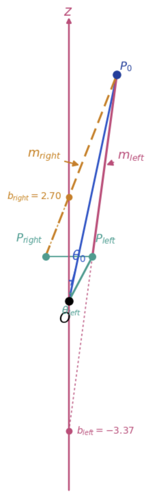

# Polar Line Intersection

Symbolic + numeric derivation of line-circle intersection in polar coordinates,
with an interactive dynamic-scaling diagram. Built for flat space research and geometry.

## Setup
pip install -r requirements.txt
jupyter notebook line_circle_intersection.ipynb

## Contents
- Symbolic derivation (slope, line equations, quadratic in sin(θ_s))
- Numeric solver with independent verification
- Slope-intercept form with closed-form b_left / b_right
- Interactive sliders for r₀, θ₀, r_left, θ_left

